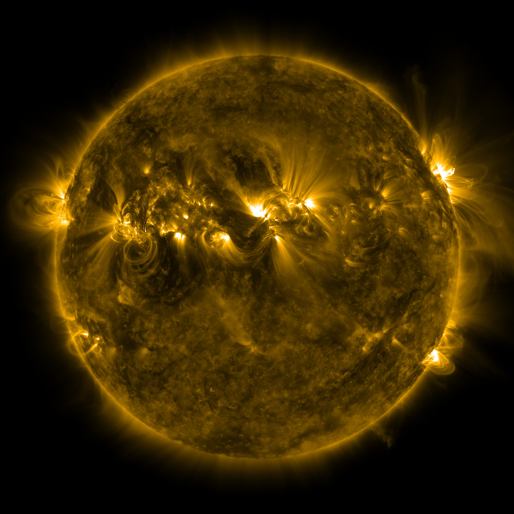

# irradiance-forecast
This repo contains the code to forecast EUV irradiance 'Stan' bands from solar images up to six days in advance.

## Packages
The packages required are located in requirements.txt

## Irradinace Data
The training script requires a '.h5' containing the Stan Bands, stored in a pandas dataframe with pandas datetime objects as the indices.

## Image Folder
The script assumes a folder of solar image files in the form of INPUT_IMAGE_FOLDER/2010/06/30/AIA20100630_0748_0171.npz which would be the file name for the 17.1nm image taken on the day 30th June 2010 at 07.48am.

# WANDB
The script assumes and requires a live WANDB account to track and store training data. Accounts be created on their site at https://wandb.ai/site.
